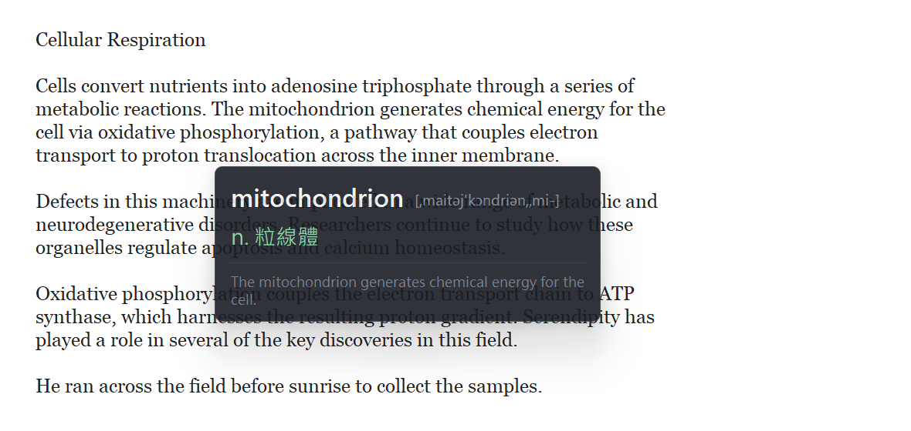
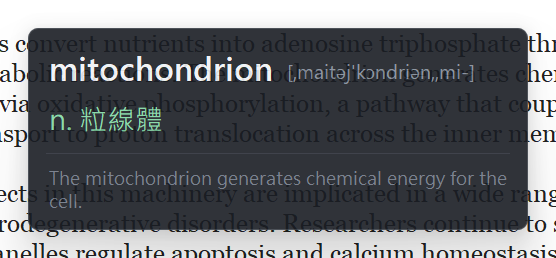
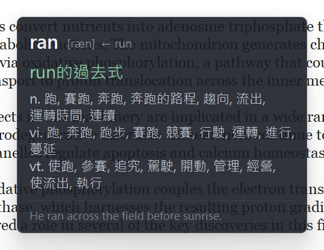

# 即時翻譯 hover-translate

**按住 `Ctrl`，滑鼠停在螢幕上任何英文字上約 0.4 秒** —— 唸出英文發音、跳出音標與繁體中文釋義、再用繁中語音說出意思。

*[English](README.en.md)*



任何視窗都有效：PDF、影片字幕、圖片裡的字、遊戲介面、無法選取的文字。因為它讀的是**螢幕畫面**，不是文字選取。

**執行期完全離線。** 76 萬詞的本地字典，主程式原始碼裡沒有任何網路模組 —— 你可以用防火牆把它擋死，功能完全不受影響。

---

## 這支程式做什麼、不做什麼

會截取螢幕的工具本來就該被懷疑，所以先把話講清楚：

| 項目 | 狀況 |
|---|---|
| 記錄鍵盤 | **不會**。只輪詢 Ctrl / Alt / H / Q / Esc 五個鍵的按下狀態，不記錄任何按鍵內容 |
| 對外連線 | **不會**。執行期沒有任何網路程式碼，可用防火牆驗證 |
| 螢幕擷取 | 只在你按住 Ctrl 並停留時，抓一次游標周圍 900×90 像素。不錄影、不存檔 |
| 磁碟殘留 | **無**。不存查詢紀錄，字典是唯讀的 |
| 系統管理員權限 | **不需要** |
| 開機自動啟動 | **不會**。不寫登錄檔、不註冊服務、不建排程 |

唯一需要網路的是**第一次建立字典**（下載 ECDICT 65 MB），之後永久離線。

原始碼裡 `import urllib` / `socket` / `requests` 一律不存在，`selftest.py` 有兩道測試在守：封鎖 `socket.socket` 之後查詢仍須成功，以及掃描原始碼確認無網路模組。

---

## 安裝

需要 **Windows 10/11** 與 **Python 3.8+**。

```bash
git clone https://github.com/AFA7777/hover-translate.git
cd hover-translate
python install.py
```

或者不用命令列：按綠色 **Code → Download ZIP**、解壓縮、雙擊 **`一鍵安裝.bat`**（或 ASCII 檔名的 `setup.bat`，兩者完全相同）。

安裝程式會裝套件、下載並建立離線字典（約 2–3 分鐘）、在桌面放一個捷徑。

每個批次檔都有一個 **ASCII 檔名的別名**，內容完全相同 —— 給中文檔名顯示成亂碼或不好輸入的環境用：

| 中文檔名 | ASCII 別名 | 用途 |
|---|---|---|
| `一鍵安裝.bat` | `setup.bat` | 安裝 |
| `啟動.bat` | `run.bat` | 帶主控台啟動（想看訊息或除錯時用） |
| `建立桌面捷徑.bat` | `make-shortcut.bat` | 重建桌面捷徑 |

> 沒裝 Python 的話請先到 [python.org](https://www.python.org/downloads/) 安裝，**務必勾選最下面的「Add Python to PATH」**，這是最常見的卡關點。

### 出現「Windows 已保護您的電腦」的藍色警告？

從網路下載的 ZIP，Windows 會替裡面每個檔案加上「來自網際網路」的標記，執行 `.bat` 時就會跳出 SmartScreen 警告。**任何從網路下載的批次檔都會這樣，不是這支程式的問題。**

兩種處理方式：

- **解壓縮前先解除封鎖（推薦，一次解決）**：對下載的 ZIP 按右鍵 → 內容 → 一般頁籤最下方勾選「解除封鎖」→ 確定 → 再解壓縮。
- **執行時放行**：警告出現時點「其他資訊」→「仍要執行」。

程式本身沒有數位簽章（那需要付費的程式碼簽章憑證），所以警告一定會出現。所有原始碼都在這個 repo 裡，可以自行檢視。

---

## 使用

| 操作 | 功能 |
|---|---|
| 按住 `Ctrl` + 滑鼠停留 0.4s | 觸發發音與查詢 |
| `Esc` 連按兩下 | 結束 |
| `Ctrl+Alt+H` | 暫停 / 恢復 |
| `Ctrl+Alt+Q` | 結束 |

`Esc` 預設要連按兩下（0.6 秒內）。Esc 是日常按最兇的鍵之一，而這是全域監聽，單按一下就關會讓你一天誤關好幾次。第一次按下時浮窗會提示「再按一次 Esc 結束」。

<table>
<tr>
<td></td>
<td></td>
</tr>
<tr>
<td align="center">專業術語（無詞頻星級）</td>
<td align="center">變化形自動追到原型並補上完整字義</td>
</tr>
</table>

浮窗由亮到暗分四層：**單字＋音標 → 主要釋義（綠）→ 其餘義項（灰）→ 分隔線 → 整句原文**，右下角是 Collins 詞頻星級（★ 越多越基礎）與考試標籤。

---

## 運作原理

```
按住 Ctrl 且滑鼠移動過 → 靜止 400ms
  ↓  BitBlt 擷取游標周圍 900×90 實體像素，StretchBlt 放大 2 倍（小字才認得出來）
  ↓  Windows.Media.Ocr 辨識，取得每個單字的 bounding rect
  ↓  挑出矩形包住游標的那個字；落在空白處則取同行 40px 內最近的字
  ↓  SAPI 英文語音唸單字
  ↓  本地 dict.db 查詢（0.03ms，不連線）
  ↓  浮窗顯示 → SAPI 繁中語音唸出第一個義項
```

幾個設計上的取捨：

- **不會誤觸**：只有「Ctrl 按下**之後**滑鼠有移動過」才會武裝觸發。所以滑鼠停在文字上按 `Ctrl+S`、`Ctrl+C` 不會突然出聲 —— 這是純滑鼠停留模式最惱人的問題。
- **浮窗點擊穿透**：套了 `WS_EX_TRANSPARENT | WS_EX_NOACTIVATE`，不吃滑鼠點擊也不搶鍵盤焦點，不會擋住你正在操作的東西。
- **圓角與陰影交給 DWM**：用 `DwmSetWindowAttribute` 讓 Windows 11 的合成器在 GPU 上畫，程式端不自繪、不需要 Pillow、不產生點陣圖。非 Win11 會靜默退回直角。
- **打斷舊語音**：每次觸發遞增 generation 序號，舊的還沒唸完會被 `SVSFPurgeBeforeSpeak` 清掉，不會積成一串。
- **詞形還原**：`generates`、`ran`、`mice`、`studying` 都查得到。先查原形，再查 10 萬條詞形還原表，最後用字尾規則回推。若釋義只有「run的過去式」這種形態說明，會自動追到原型把完整字義接上。
- **DPI 感知**：啟動時宣告 `PER_MONITOR_DPI_AWARE`，縮放非 100% 或多螢幕時游標座標才不會與螢幕像素錯開。

### 效能

| 項目 | 實測 |
|---|---|
| 浮窗渲染一次 | 中位數 6.7ms |
| 字典查詢一次 | 0.03ms |
| 閒置 12 秒的 CPU 時間 | 0ms |
| 記憶體（私有） | 約 60 MB |

全部美化都是靜態屬性 —— 沒有動畫、沒有計時器、沒有逐格重繪。

---

## 繁體轉換的品質

ECDICT 的釋義是簡體，建字典時用 OpenCC `s2twp` 轉成繁體台灣用詞。**資訊類幾乎完美**：

```
软件→軟體  内存→記憶體  打印机→印表機  数据库→資料庫  程序→程式
网络→網路  鼠标→滑鼠  算法→演算法  人工智能→人工智慧  视频→影片
```

但 OpenCC 處理不了台灣用**不同構詞**（而非不同字）的術語，最典型的是 `线粒体` 只會變成「線粒體」，台灣其實叫「粒線體」。

這類靠 **`用語修正.txt`** 補救 —— 純文字對照表，在執行期套用，**改完存檔重啟即生效，不需要重建字典**。目前收了 104 條（粒線體、雷射、微中子、機率、伺服器、執行緒、快取…）。

查到不對的詞就自己加一行：

```
線粒體=粒線體
```

> **加規則的鐵則：這是無條件字串取代，不要加短詞或多義詞。** 加 `類=類別` 會把「人類」變成「人類別」。專案刻意排除了「函數」（數學用函數、程式用函式，台灣兩者都對）、「數據」（大數據是台灣正式用語）、「文件」（也指 document）。

歡迎送 PR 補充這張表。

---

## 設定

`config.json` 在首次執行時產生。改完存檔，重啟程式生效。

| 欄位 | 預設 | 說明 |
|---|---|---|
| `modifier` | `"ctrl"` | 觸發要按住的鍵：`ctrl` / `alt` / `shift` / `none`（`none` = 純停留，會很吵） |
| `dwell_ms` | `400` | 滑鼠要靜止多久才觸發 |
| `capture_width` / `capture_height` | `900` / `90` | 擷取範圍（實體像素，以游標為中心） |
| `ocr_scale` | `2` | OCR 前放大倍率。字很小認不出來時調 3 |
| `ocr_language` | `"auto"` | `auto` / `en-US` / `zh-Hant-TW` |
| `speak_english` / `speak_chinese` | `true` | 是否唸英文單字 / 繁中釋義 |
| `speak_sentence_english` | `false` | 連整句英文一起唸（練聽力再開） |
| `english_voice` / `chinese_voice` | `Zira` / `Hanhan` | SAPI 語音名稱**關鍵字**，比對系統已安裝的語音 |
| `english_rate` / `chinese_rate` | `0` | 語速 `-10` ~ `10` |
| `opacity` | `0.9` | 浮窗不透明度。低於 `0.6` 底下文字會透上來 |
| `show_sentence` | `true` | 顯示整句原文（純上下文，不翻譯也不外傳） |
| `show_phonetic` / `show_stars` | `true` | 顯示音標 / Collins 詞頻星級 |
| `exam_tags` | `["toefl","ielts","gre"]` | 只顯示清單內的考試標籤。ECDICT 另有中國的 `zk`/`gk`/`ky`/`cet4`/`cet6`，預設不顯示。設 `[]` 整排關閉 |
| `max_senses` | `4` | 最多顯示幾個義項 |
| `esc_quit` | `"double"` | `double` 連按兩下 / `single` 按一下 / `off` 停用 |
| `hide_after_ms` | `6000` | 浮窗幾毫秒後自動消失 |
| `debug` | `false` | 主控台印出 OCR 全文與各段耗時 |

---

## 自測

```bash
python selftest.py
```

62 項檢查，把已知英文畫到螢幕上再走一次完整管線讀回來 —— 驗證螢幕擷取、OCR、游標挑字、字典查詢、繁體修正、詞形還原、**零連線**、語音、浮窗、Esc 判定、單一實例鎖。

只想重驗字典品質（20 個代表性單字）：

```bash
python build_dict.py --verify
```

---

## 參考環境

**每台機器不同，請以 `selftest.py` 印出的實際值為準。** 開發機上的情況：

- Windows OCR 可用語言只有 `ja` 與 `zh-Hant-TW`，**沒有英文語言包** —— 但 zh-Hant-TW 引擎辨識英文完全正確（實測整句一字不差），所以不必特地去裝。附帶好處是中日文也讀得到。
  - 要裝英文 OCR：設定 → 時間與語言 → 語言與地區 → English → 語言選項 → 選用功能加「光學字元辨識」，然後把 `ocr_language` 設成 `"en-US"`。
- SAPI 語音：`Microsoft Zira Desktop`(en-US)、`Microsoft Hanhan Desktop`(zh-TW)、`Microsoft Haruka Desktop`(ja-JP)，全部離線。**你的機器語音名稱可能不同**，`english_voice` / `chinese_voice` 是關鍵字比對，用自測印出的清單去對。
- 字典：768,739 詞、詞形還原 103,102 條、`dict.db` 79 MB。

---

## 已知限制

- **沒有上下文判斷**：字典會列出所有義項，不會像線上翻譯那樣依上下文挑一個。`thread` 給你「線、絲、纖維」而不是「執行緒」。這是換取零連線的代價。
- **OCR 吃畫面品質**：深色底、極小字、襯線字體、字被圖案壓住時準確度會掉。調高 `ocr_scale` 通常有救。
- **只處理英文單字**：純數字與符號會被過濾。連字號與撇號（`well-known`、`don't`）算同一個字。
- **新詞與專有名詞**：ECDICT 收錄到 2020 年前後，太新的術語或人名地名可能查不到。
- **全螢幕獨佔模式的遊戲**擷取不到畫面，切成視窗化或無邊框視窗即可。
- 僅支援 Windows。OCR、語音、螢幕擷取、圓角全都用 Windows 專屬 API。

---

## 授權

MIT，見 [LICENSE](LICENSE)。第三方元件聲明見 [NOTICE](NOTICE)。

本程式**不夾帶任何字典資料** —— `build_dict.py` 在使用者自己的機器上從官方 repo 下載並建置。

- 字典資料：[ECDICT](https://github.com/skywind3000/ECDICT)（MIT）
- 簡繁轉換：[OpenCC](https://github.com/BYVoid/OpenCC)（Apache 2.0），僅建字典時使用
